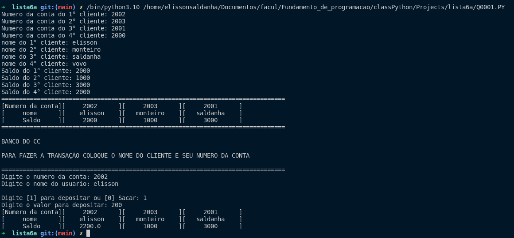
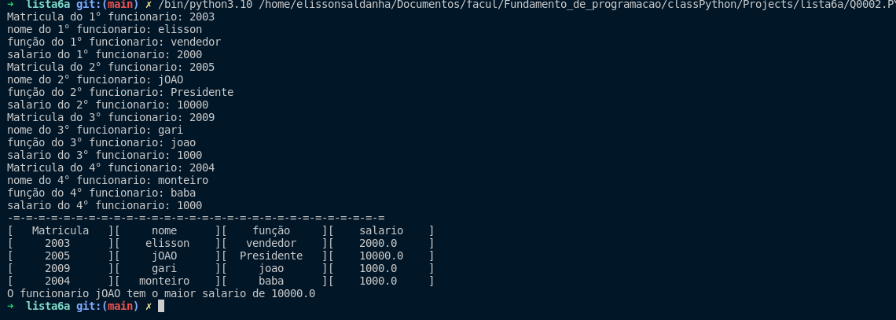
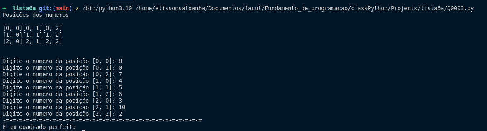

# Lista de Exercicios Python
**Curso:** Ciência da Computação

## 1° Questão

**Probela:** Deseja-se atualizar as contas correntes dos clientes de uma agência bancária. É dado o cadastro de
5 clientes contendo para cada um as seguintes informações: o número da conta, nome, saldo e
OP (pode ser C ou D).; implemente uma matriz 5 x 5 que mostre o movimento bancário de cada
um desses cliente.

**Resultado**

## 2° Questão

**Problema:** Deseja-se fazer a emissão da folha de pagamento de uma empresa. Para os 4 funcionários de uma empresa são dadas as seguintes informações: (matrícula, nome, função e salário). Implemente uma matriz 4 x 4 para emissão dessas informações, depois mostre quem ganha o maior e o menor
salário.

**Resultado**

## 3° Questão

**Problea:**  Dizemos que uma matriz quadrada inteira é um quadrado mágico se a soma dos elementos de cada linha, a soma dos elementos de cada coluna e a soma dos elementos das diagonais principal e
secundária são todas iguais. Implemente uma matriz quadrada (quadrado mágico), insira valores aleatórios e, depois, mostre a
mensagem “É uma matriz QUADRADO MÁGICO” ou “NÃO é uma matriz QUADRADO
MÁGICO” e os seus valores.

**Resposta:**

## 4° Questão

**Problema:** Um campeonato de futebol foi disputado por N times identificados pelos seus nomes. Para cada
time são considerados os seguintes dados:

**Item A:** Dados os resultados de m jogos, imprima uma tabela com todos os dados (PG, GM, GS, S, V, GA,
igual àquela que sai no jornal) dos n times. Cada resultado é representado na forma (t1,t2,n1,n2) cuja
interpretação é a seguinte: no jogo t1 x t2 (times), o resultado foi n1 x n2 (placar);

**Item B:** Com os mesmos dados do item (a), imprima a classificação dos times no campeonato (do primeiro
para o último). A classificação é pelo número de pontos ganhos (PG) e em segundo lugar pelo saldo de
gols (S). Se houver empate segundo os dois critérios, classifique os times envolvidos pelo maior número
de gols marcados no campeonato.

### Lógica da 4° Questão

[ ] Primeiro eu digito a quantidade de times que a tabela vai ter

[ ] Utilizar o calculo da combinação de 3 a 2 para fazer a quantidade de partidas sem repetições

[ ] Depois vou colocar os nomes dos times de acordo com a quantidade de times

[ ] VOu criar uma tabela com as colunas 'TIMES. PG, GM, S, V, GA' e com a quantidade de linha de acordo com a quantidade de times com todos os valores 0

[ ] Vou criar as partidas automaticamente de acordo com os times com esse e codigo

[ ] perguntar ao usuario se o tim1 x time2 já ocorreu

[ ] se a reposta for sim, perguntar ao usuario a quantidade de gols de cada time naquele partida

[ ] Adicionar a pontuação na tabela

[ ] Monstar a tabela sem ordenar a classificação

[ ] Ordenanr a classificação dos times de acordo com a pontuação na tabela

[ ] Imprimir a tabela no terminal 

    